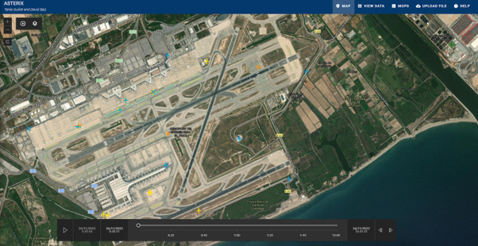
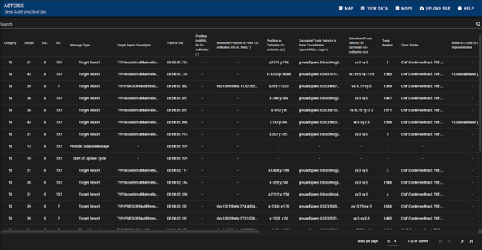

# ASTERIX

## Introduction

ASTERIX is a [ASTERIX](https://www.eurocontrol.int/asterix) binary file decoder built in Javascript with Electron and the Vue framework. 
It is able to decode records from Category 10 and Category 21.

## Authors

Tania Guillot and David Saiz

## Installation

Download the [Windows executable](https://drive.google.com/file/d/1PU3Qr1bLf0-sZSITEU5x-XWO7nhXVk6i/view?usp=share_link)

### Development environment

To be able to develop the app it is necessary to have downloaded and installed [Node](https://nodejs.org/es/download/). To check if it is installed correctly, open a terminal and execute:

```
node -v

npm -v
```
Both commands should return the version installed.


Once the project is cloned, execute the command `npm install` to download the necessary dependencies. To create the binary files, execute `npm run electron:build`. Vue allows to work on an application that changes when the code is edited, to run it execute `npm run electron:serve`.

**The application has been tested in Ubuntu 20.04 LTS and Windows 10.**


## Views 

### MAP

Shows the MLAT, SMR, and ADSB airplanes. You can change layer visibility and enable path history. 
By clicking on a plane, you can see its information and export its path to kml.


### VIEW DATA

Tables containing the data from the uploaded file.
Can search by fields, expand rows, and download the table to csv.


### MOPS

Update rate and probability of identification values computed.

### UPLOAD FILE

To upload the file containing the data.


## Installation

Download the executable and run it

## Architecture


## Authors

Tania Guillot and David Saiz
